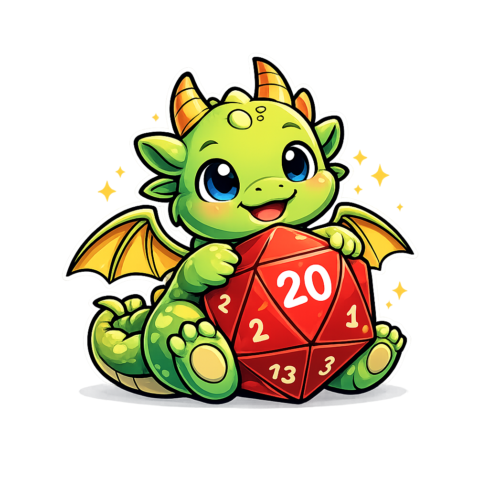

# The nat20 Language

_Powered by Dice, Debugged by Wizards._

`nat20` is a small, strongly and dynamically typed programming language
that offers fun DnD-themed features that help you navigate
runtime uncertainty. 
